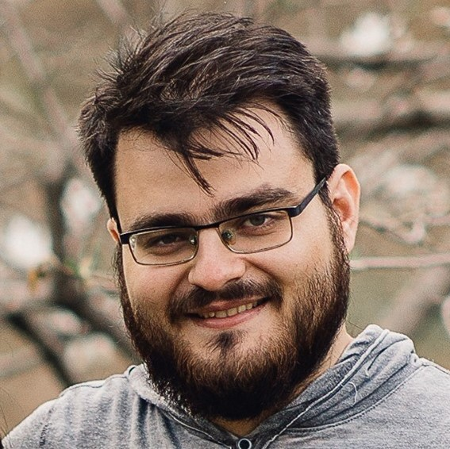

 Hi there! My name is Andreas Katis and I am a Computer Scientist for KBR, Inc. and a member of NASA Ames's Robust Software Engineering group (RSE). My research background is in the application of formal methods for the analysis of software systems, primarily at the level of requirements. I earned my BSc degree from the <a href="https://www.ceid.upatras.gr/en">Computer Engineering and Informatics Department (C.E.I.D.)</a> at the University of Patras. I received my MsC and PhD in Computer Science from the <a href="https://cse.umn.edu/cs">University of Minnesota</a> in 2020, under the supervision of Dr. Michael W. Whalen. My PhD thesis was on the development of realizability checking and reactive synthesis techniques for infinite-state problems. 

&nbsp;
&nbsp;
&nbsp;

  
Current projects:

- [Formal Requirements Elicitation tool (FRET)](https://github.com/NASA-SW-VnV/fret) : Integration of realizability checking analysis and diagnosis of unrealizable results
- [Contract based Compositional verification of Simulink models (CoCoSim)](https://github.com/NASA-SW-VnV/CoCoSim) : Main developer
